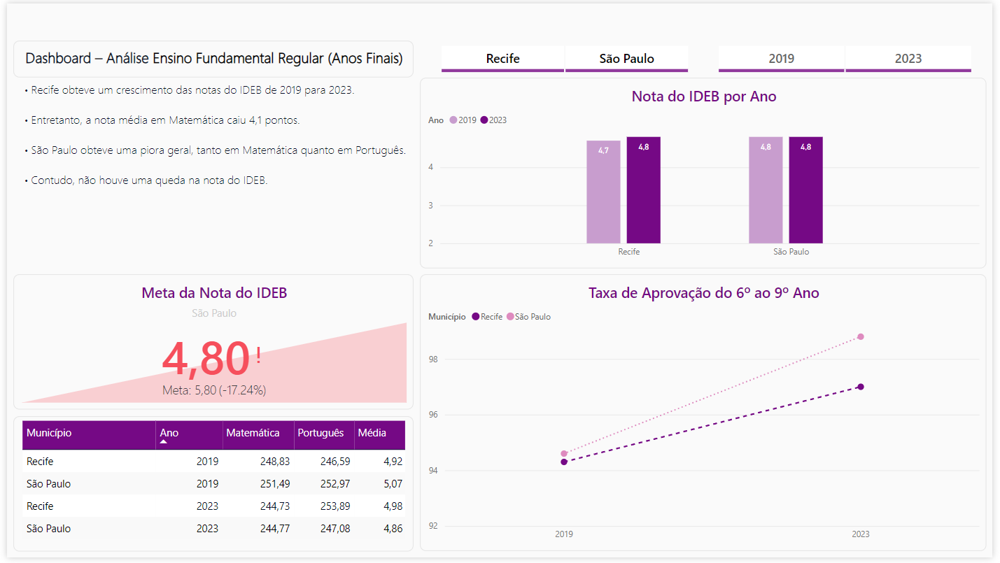

# Case Técnico - SP Parcerias

## Objetivo
### Análise de Desempenho Escolares em Escolas Públicas

Uma Prefeitura tem interesse em avaliar o desempenho escolar de alunos do Ensino Fundamental Regular – Anos Finais de escolas públicas municipais da capital de São Paulo e de Pernambuco, com foco na comparação entre os anos 2019 e 2023.

Para isso, o analista de dados utilizará o Índice de Desenvolvimento da Educação Básica (IDEB) para análise detalhada. O objetivo é comparar os dados de desempenho entre os municípios, em ambos os períodos, e identificar tendências, melhorias e pontos de atenção. 

## Orientações
1. Utilizar os programas R ou Python para Tratamento de Dados. Portanto, deve ser enviado um script documentado que mostre todas as etapas realizadas;

2. Apresentar os resultados em gráficos no Power BI para visualização. Logo, deve ser enviado um link ou uma captura de tela do dashboard criado, evidenciando as principais percepções.

## Resultados

- Recife obteve um crescimento das notas do IDEB de 2019 para 2023.

- Entretanto, a nota média em Matemática caiu 4,1 pontos.

- São Paulo obteve uma piora geral, tanto em Matemática quanto em Português.

- Contudo, não houve uma queda na nota do IDEB.

## Tratamento dos dados
Mais informações sobre o tratamento dos dados em: [Case_SP_Parcerias](Case_SP_Parcerias.ipynb)